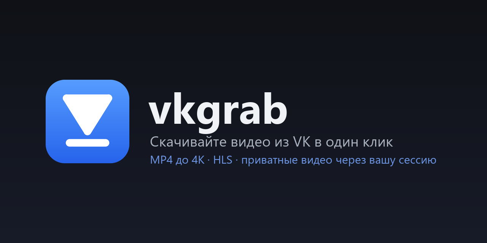
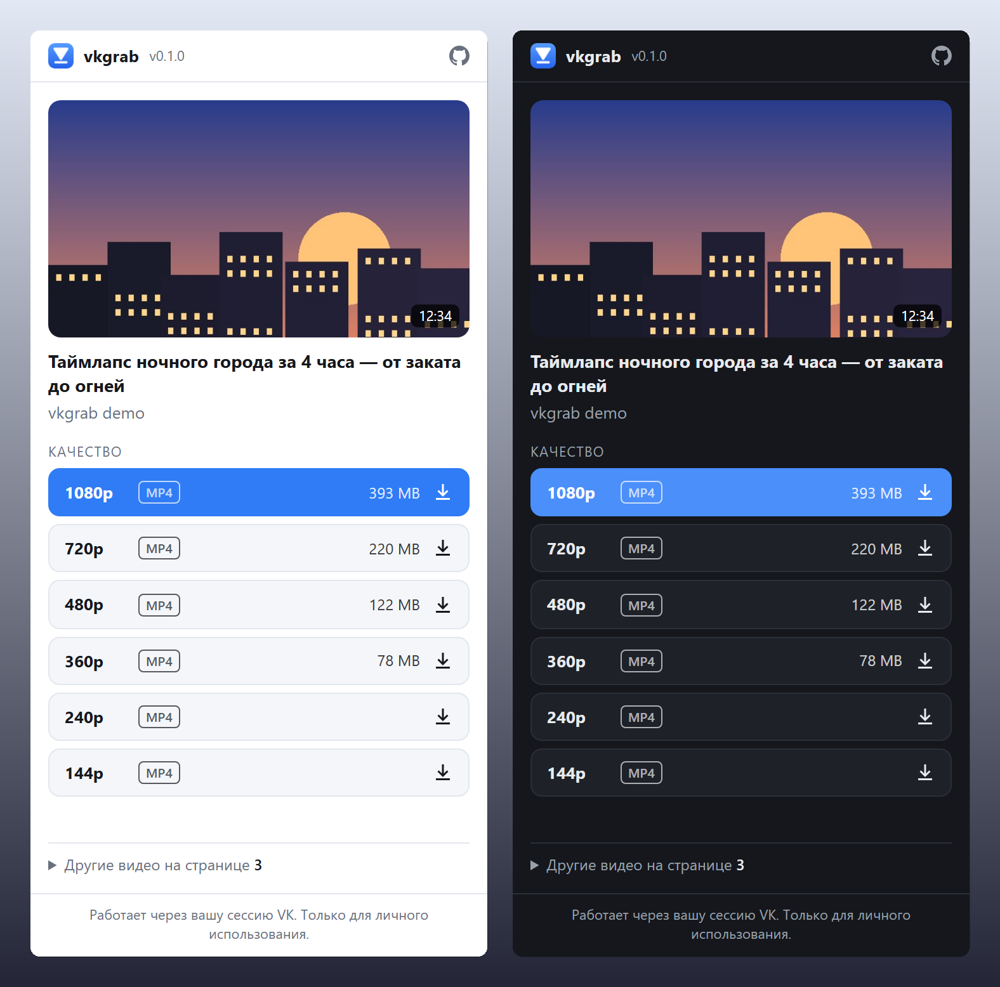

<p align="center">
  
</p>

<p align="center">
  <a href="https://github.com/web3daemon/vkgrab/actions/workflows/ci.yml"></a>
  <a href="https://github.com/web3daemon/vkgrab/releases/latest"></a>
  
  
  <a href="LICENSE"></a>
</p>

<p align="center"><a href="README.md">Русский</a> · <b>English</b></p>

**vkgrab** is a Chrome extension that downloads videos from **vk.com** and **vkvideo.ru** in their original quality. Open a video, click the icon, pick a quality, and the file lands in your Downloads folder. It uses no third-party sites, ads or proxy servers. The extension works through your own VK session, so private and "signed-in only" videos download too.

<p align="center">
  
</p>

## Features

- **Every quality VK serves**: 144p–1080p and higher (1440p/4K when the video has it), with the file size of each option.
- **Private and restricted videos**: requests are made as your account, exactly like VK's own player.
- **Works across VK**: video pages, clips, feed and wall posts, communities, the `?z=video…` modal, and `?list=…` access-key links.
- **Every video on the page**: when a feed has several, pick one under "Other videos on this page".
- **HLS fallback**: when a video has no ready MP4 (long videos, stream recordings), the extension fetches the stream segments inside the tab and joins them into a `.ts`, with a progress toast in the corner.
- **Clean filenames**: `Video title [-12345_67890] 1080p.mp4`, safe on Windows, macOS and Linux.
- Remembers your preferred quality, supports light and dark themes, and has a Russian and English UI.
- **Zero dependencies**: about 25 KB of plain JavaScript, no bundler, readable in ten minutes.

## Install

vkgrab is not in the Chrome Web Store yet, and installing it by hand takes a minute:

1. Download `vkgrab-x.y.z.zip` from [Releases](https://github.com/web3daemon/vkgrab/releases/latest) and unzip it.
2. Open `chrome://extensions` and turn on **Developer mode** (top right).
3. Click **Load unpacked** and pick the unzipped folder (the one that contains `manifest.json`).
4. Pin vkgrab from the 🧩 menu.

From source:

```bash
git clone https://github.com/web3daemon/vkgrab.git
```

Then pick `vkgrab/extension` in step 3. Works in any Chromium 110+ browser: Chrome, Edge, Yandex Browser, Brave, Opera, Vivaldi.

## Usage

1. Open a video on vk.com or vkvideo.ru, and sign in if it is restricted.
2. Click the vkgrab icon.
3. Pick a quality. The best one is highlighted, and after your first download your usual choice is.

MP4 goes through Chrome's own download manager, so you get progress, pause and resume. HLS downloads inside the tab, so keep the VK tab open until it finishes.

## How it works

```
VK tab (content script)                             popup
───────────────────────                             ─────
POST /al_video.php?act=show  ◄── your session ──    "which videos are on this page?"
  └─ player params: url144…url2160, hls              "show me the qualities"
                                                     │
        MP4 ──────────────────────────────────────► chrome.downloads.download()
        HLS: master.m3u8 → segments → Blob → .ts    (progress toast in the page)
```

vkgrab does what VK's player does when you press play. It asks `al_video.php` for the player parameters from the page context, with your cookies. The answer contains direct MP4 links for each quality. They are signed and bound to your IP and browser, so Chrome downloads them directly from the same machine. When no MP4 exists, it takes the HLS playlist and fetches segments four at a time, retrying on errors.

## Privacy

vkgrab **sends nothing anywhere**. It has no analytics, no telemetry and no servers of its own. The only requests go to VK and its CDN, the same ones normal playback makes. See [PRIVACY.md](PRIVACY.md).

| Permission | Why |
| --- | --- |
| `vk.com`, `vk.ru`, `vkvideo.ru` | find videos on the page and ask VK for the links with your session |
| `downloads` | save MP4 files through Chrome's download manager |
| `scripting` | attach to VK tabs that were open before installing |
| `storage` | remember your preferred quality, locally |

## Limitations

- **Live streams** are not supported. Wait for the recording.
- **The mobile site** `m.vk.com` is not supported. Use `vk.com` or `vkvideo.ru`.
- **DRM-protected videos** (some paid movies and series) cannot be saved, and vkgrab tells you so.
- HLS is saved as `.ts`, which VLC and most players open. To remux it to MP4 losslessly:

  ```bash
  ffmpeg -i "video.ts" -c copy "video.mp4"
  ```

- vkgrab relies on VK's internal API. If VK changes it, [open an issue](https://github.com/web3daemon/vkgrab/issues).

## Development

```bash
npm test              # unit tests (Node 20+)
npm run check         # manifest, referenced files, locale keys
npm run pack          # dist/vkgrab-<version>.zip
python scripts/smoke.py https://vkvideo.ru/video-XXXX_YYYY   # live run in Chromium (playwright)
```

After a change, hit ⟳ on the extension in `chrome://extensions` and reload the VK tab. The layout is described in the [Russian README](README.md#разработка).

## Legal

vkgrab is for personal use: saving your own videos, watching offline, keeping an archive. Respect copyright and VK's terms, and don't redistribute other people's content without permission. This project is not affiliated with or endorsed by VK.

## License

[MIT](LICENSE) © web3daemon
